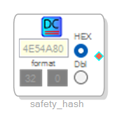
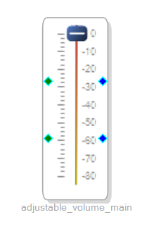
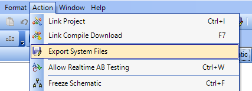

[](https://github.com/pre-commit/pre-commit) [](https://results.pre-commit.ci/latest/github/elagil/sigmadsp/main)
# Analog Devices Sigma DSP control software

This software package is a Python application, which controls Analog Devices
digital signal processors ([DSPs](https://en.wikipedia.org/wiki/Digital_signal_processor)). It exposes a TCP server for
connecting with SigmaStudio, allowing to upload new applications to the DSP, as well as debugging it. Essentially, it
behaves like a wired debug probe, but with an Ethernet connection. This source code was inspired by [the original TCP service](https://wiki.analog.com/resources/tools-software/linux-software/sigmatcp),
as well as the [hifiberry-dsp](https://github.com/hifiberry/hifiberry-dsp) project. However, this application was written completely from scratch, in an effort to make it more efficient, stable, and faster.

This software package contains two separate components: a backend service, as well as a frontend interface. It is meant
to run on single-board computers that connect to an Analog Devices DSP via the serial peripheral interface ([SPI](https://en.wikipedia.org/wiki/Serial_Peripheral_Interface)) - specifically the Raspberry Pi.

## Backend service

The backend service is the core application, which
- connects to the DSP via SPI or I2C,
- exposes a TCP interface towards SigmaStudio (on the default port `8087`),
- and provides a remote procedure call (RPC) interface, based on [grpc](https://grpc.io/).

With the latter, a frontend can connect to the backend service and control it remotely.

## Frontend interface

The frontend interface connects to the RPC service of the backend, allowing the user to control
settings via a command-line interface (CLI). Currently, the frontend supports
- Resetting the DSP (soft or hard)
- Read arbitrary registers
- Change or set volume on a DSP volume register
- Read SigmaStudio parameter files and parse them in the backend

## Supported chipsets

This is not an extensive list, but only comprises chips that are tested or likely compatible.

DSP|Status|Backend settings `dsp_type`
---|---|--
[ADAU140x](https://www.analog.com/media/en/technical-documentation/data-sheets/ADAU1401.pdf) | Untested, but register compatible with ADAU170x | `adau1x0x`
[ADAU170x](https://www.analog.com/media/en/technical-documentation/data-sheets/ADAU1701.pdf) | Tested | `adau1x0x`
[ADAU145X](https://www.analog.com/media/en/technical-documentation/data-sheets/ADAU1452_1451_1450.pdf) | Tested | `adau14xx`
[ADAU146X](https://www.analog.com/media/en/technical-documentation/data-sheets/ADAU1463-1467.pdf) | Tested | `adau14xx`

The last column denotes the string to put in the backend settings file (see [Configuration](#configuration)) for the `dsp_type` setting.

## Installation
:zap: **Running the installation can overwrite your existing configuration.** For upgrading, see [Upgrading](#upgrading)!

For installing, please install git first, then clone this repository and run the installation script.

```bash
sudo apt install git &&
git clone https://github.com/elagil/sigmadsp.git &&
cd sigmadsp &&
./install.sh
```

The script installs the Python package, which includes the `sigmadsp-backend` (the backend) and `sigmadsp` (the frontend) executables.
It also sets up a system service, which runs `sigmadsp-backend` in the background.

[pipx](https://pypa.github.io/pipx/) is used for installing the Python package in an isolated way, without having to use `sudo pip install <package>`.

## Upgrading

For upgrading, use `pipx` to upgrade the Python package and restart the backend service afterwards:

```bash
pipx upgrade sigmadsp &&
sudo systemctl restart sigmadsp-backend.service
```

## Removal

From within the previously cloned repository folder `sigmadsp` run

```bash
./uninstall.sh
```

If you find that this removal procedure leaves any files unremoved, please open an issue.

## Backend configuration

Configuration of `sigmadsp` is done via a `*.yaml` file, which is created during installation. Its default path is `/var/lib/sigmadsp/config.yaml`. The default configuration is shown below.

```yaml
# This config.yaml file contains all settings that can be changed on the sigmadsp-backend.

# The IP address and port, on which the sigmadsp-backend listens for requests from SigmaStudio.
host:
  # The default value "0.0.0.0" allows listening on any address.
  ip: "0.0.0.0"
  port: 8087

# Settings for the sigmadsp-backend.
backend:
  # The port, on which the sigmadsp-backend is reachable.
  port: 50051

parameters:
  # The parameter file path, which contains DSP application parameters,
  # such as cell names, addresses and other information. This parameter file is required
  # for the backend, in order to be able to control DSP functionality at runtime, e.g. volume.
  path: "/var/lib/sigmadsp/current.params"

dsp:
  # The type of the DSP to control with the sigmadsp-backend service.
  # Can be "adau14xx" or "adau1x0x".
  type: "adau14xx"
  # The protocol used to communicate.
  # Can be "spi" or "i2c"
  protocol: "spi"
  bus_number: "0"
  device_address: "0"

  pins:
    # The DSP's hardware reset pin.
    reset:
      number: 17
      active_high: false
      initial_state: true
      mode: "output"

    # The self-boot pin, enabling the DSP to load its application from external flash when set.
    self_boot:
      number: 22
      active_high: true
      initial_state: true
      mode: "output"
```

## Frontend usage

For a list of commands that can be emitted by the frontend, please type

```bash
$ sigmadsp --help
Usage: sigmadsp [OPTIONS] COMMAND [ARGS]...

  Command-line tool for controlling the sigmadsp-backend.

Options:
  --port INTEGER    Set the port, on which the backend listens for requests.
                    [default: 50051]
  --ip IPV4ADDRESS  Set the IP address, on which the backend listens for
                    requests.  [default: 127.0.0.1]
  --help            Show this message and exit.

Commands:
  change-volume    Changes the volume by a certain amount in dB.
  load-parameters  Load a parameter file.
  read-register    Reads a DSP register.
  reset            Resets the DSP.
  set-volume       Sets the volume to a certain value in dB.
```

For more information on a command, use `--help` on that command, for example
```bash
$ sigmadsp read-register --help
Usage: sigmadsp read-register [OPTIONS] ADDRESS LENGTH

  Reads a DSP register.

Options:
  --help  Show this message and exit.
```

## Loading parameters

A key feature of this application is the ability to control the connected DSP at runtime. At this point, it is only possible
to adjust the volume of a volume cell by means of the `change-volume` and `set-volume` commands.

For this to work, the backend requires knowledge about the program that is loaded onto the DSP. The register
addresses at which the volume cells are located, must be known, in order to adjust their values.
Conveniently, SigmaStudio can export a so-called parameter file that holds this information.

### The safety hash cell

There is a safety mechanism is the `sigmadsp` application that makes sure that the parameter file matches the software
that is running on the DSP. This is important, as changing the DSP software also changes register addresses. If the
`sigmadsp` application attempted to write to an incorrect register address, this can have unforseeable consequences.

Therefore, you must include a `DC` cell in your DSP program, which contains a random value, and is called `safety_hash`.
On startup, the `sigmadsp-backend` will try to read the `safety_hash` cell from the DSP and only allow write access,
if the content matches the value of the provided parameter file. This ensures that the parameter file and DSP application
are consistent.

This is an example of a safety hash cell.



### Defining adjustable cells

For the `change-volume` and `set-volume` commands to work, there needs to be at least one adjustable volume slider in the
DSP program. Currently, only a single slider is supported for adjustment.

Add a volume slider, as seen below, to your program. Be sure to call it `adjustable_volume_main`.



In the future, multiple adjustable sliders will be supported. They will be addressed by means of a unique name.
The naming scheme for sliders will be `adjustable_volume_<name>`.

### Exporting and loading a parameter file

Finally, the parameter files of the DSP program can be exported and loaded into sigmadsp.

First, use the `Export system files` feature of SigmaStudio



Store the files in a location of your choice. Among the exported files, there is one file that has the ending `*.param`.
Transfer it to the Raspberry Pi that runs the `sigmadsp` application.

Next, run

```bash
$ sigmadsp load-parameters <parameter_file>.params
```

If the safety hash cell content did not match, the call will return

```bash
INFO:root:Safety check failed, parameters cannot be adjusted.
```

If everything went well, the call instead returns

```bash
INFO:root:Loaded parameters, control is unlocked.
```

In that case, you can now adjust volume settings, for example by setting a new value in dB

```bash
$ sigmadsp set-volume -10
INFO:root:Set volume of cell 'adjustable_volume_main' to -10.00 dB.
```

or by adjusting the current value by a certain offset in dB with

```bash
$ sigmadsp change-volume -10
INFO:root:Set volume of cell 'adjustable_volume_main' to -20.00 dB.
```

The `change-volume` command reads the current volume level, and changes it by the chosen amount.
